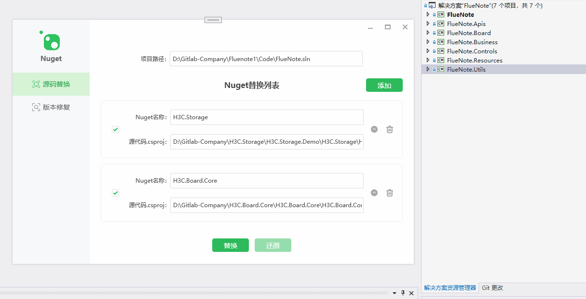

# NugetEfficientTool

### 介绍
这是一个Nuget效率工具，用于提升项目与组件间开发过程中的一些重复、流程性问题。如：
1. Nuget包替换为源码引用
3. 修复解决方案下引用Nuget不同版本的问题

### 安装教程

#### Nuget源码替换
1. 项目路径，输入仓库代码所在的目录(也可以是多仓库目录)，或者仓库解决方案.sln文件路径
2. 输入Nuget包H3C.Family.App对应的源代码csproj文件路径，或者csproj所在目录。输入后，会自动填充Nuget名称H3C.Family.App
3. 点击“替换”，替换所有csproj项目内H3C.Family.App的Nuget引用PackageReference，为H3C.Family.App的项目引用ProjectReference，就可以开始源代码调试了

支持目录下的Nuget替换，极大提升了多项目多仓库协同开发的效率。如下图是操作图：

Nuget替换，目前版本支持：
1. 一个解决方案，对多个Nuget源的替换
2. 目录即多个解决方案，对多个Nuget源的替换
3. 支持多个相互之间依赖的Nuget包替换（自动识别依赖）和还原

#### Nuget版本升级
1. 项目路径，输入仓库代码所在的目录（也可以外层目录）、解决方案sln文件路径
2. 点击“开始检测”，会显示Nuget待修复信息。如上图，H3C.Setting.Camera存在很多csproj文件内版本是一致的，但与Nuget源最新版本不一致，需要升级
3. 点击“修复版本冲突”，弹出版本选择窗口，选择相应版本执行修复。执行后，csproj都会同步H3C.Setting.Camera版本为1.1.15
如下图，这是某个目录下对所有项目检测的版本冲突信息： 
 
选择一键修复，就可以统一指定组件的版本号了： 
 
选择版本时，可以全选也可以指定Nuget同步版本号。 
另外，设置Nuget源后就可以直接升级官方版本了，这里设置的是公司FTP服务器Nuget归档地址： 
 

### 下载安装
点击下载最新版本：[Nuget工具_1.0.3.1012.exe](/Readme/Nuget工具_1.0.3.1012.exe) 
注：Jenkins打包用到的修复工具，请切换至代码分支JenkinsFix，编译生成。 
